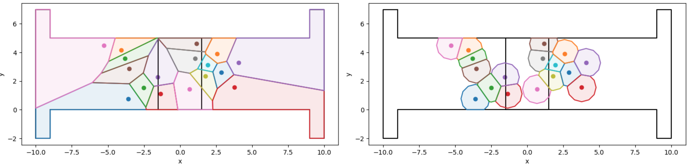

<div align="center">
    
</div>

-----------------
[](https://pypi.org/project/pedpy/)
[](https://test.pypi.org/project/PedPy/)

[](https://doi.org/10.5281/zenodo.7386931)
[](https://github.com/PedestrianDynamics/pedpy/blob/main/LICENSE)

[](https://github.com/psf/black)
[](https://pycqa.github.io/isort/)
[](http://pedpy.readthedocs.io/?badge=latest)
[](https://bestpractices.coreinfrastructure.org/projects/7046)
[](https://fair-software.eu)

# PedPy: Analysis of pedestrian dynamics based on trajectory files.  

*PedPy* is a python module for pedestrian movement analysis. 
It implements different measurement methods for density, velocity and flow.

If you use *PedPy* in your work, please cite it using the following information from zenodo:

[](https://doi.org/10.5281/zenodo.7386931)


## Getting started

### Setup Python

For setting up your Python Environment a Python version >= 3.10 is recommended (our code is tested with 3.10 and 3.11).
To avoid conflicts with other libraries/applications the usage of virtual environments is recommended, see [Python Documentation](https://docs.python.org/3/library/venv.html) for more detail.

### Installing PedPy

To install the latest **stable** version of *PedPy* and its dependencies from PyPI:
```bash
python3 -m pip install pedpy
```

If you want to install the current version in the repository which might be unstable, you can do so via:
```bash
python3 -m pip install --pre --index-url https://test.pypi.org/simple/ --extra-index-url https://pypi.org/simple/ pedpy
```

### Usage

For first time users, have a look at the [getting started notebook](notebooks/getting_started.ipynb), as it shows the first steps to start an analysis with *PedPy*.
A more detailed overview of *PedPy* is demonstrated in the [user guide notebook](notebooks/user_guide.ipynb).
The [fundamental diagram notebook](notebooks/fundamental_diagram.ipynb) shows how to use *PedPy* for computing the fundamental diagram of a series of experiments.

#### Interactive online session

If you want to try out *PedPy* for the first time, you can find an interactive online environments for both notebooks here:

- Getting started: [](https://mybinder.org/v2/gh/PedestrianDynamics/PedPy/main?labpath=notebooks%2Fgetting_started.ipynb)
- User guide: [](https://mybinder.org/v2/gh/PedestrianDynamics/PedPy/main?labpath=notebooks%2Fuser_guide.ipynb)
- Fundamental diagram: [](https://mybinder.org/v2/gh/PedestrianDynamics/PedPy/main?labpath=notebooks%2Ffundamental_diagram.ipynb)

**Note:** 
The execution might be slower compared to a local usage, as only limited resources are available.
It is possible to also upload different trajectory files and run the analysis completely online, but this might not be advisable for long computations.

#### Local usage of the notebooks

For local usage of the notebooks, you can either download the notebooks and [demo files](notebooks/demo-data) from the GitHub repository or clone the whole repository with:
```bash 
git clone https://github.com/PedestrianDynamics/pedpy.git
```

For using either of the notebook some additional libraries need to be installed, mainly for plotting.
You can install the needed libraries with:

```bash
python3 -m pip install jupyter matplotlib
```

Afterward, you can start a jupyter server with:

```bash
jupyter notebook
```

After navigating to one of the notebooks, you can see how the library can be used for different kinds of analysis.

Some examples how the computed values can be visualized are also shown in the notebooks, e.g., density/velocity profiles, fundamental diagrams, N-T-diagrams, etc.




