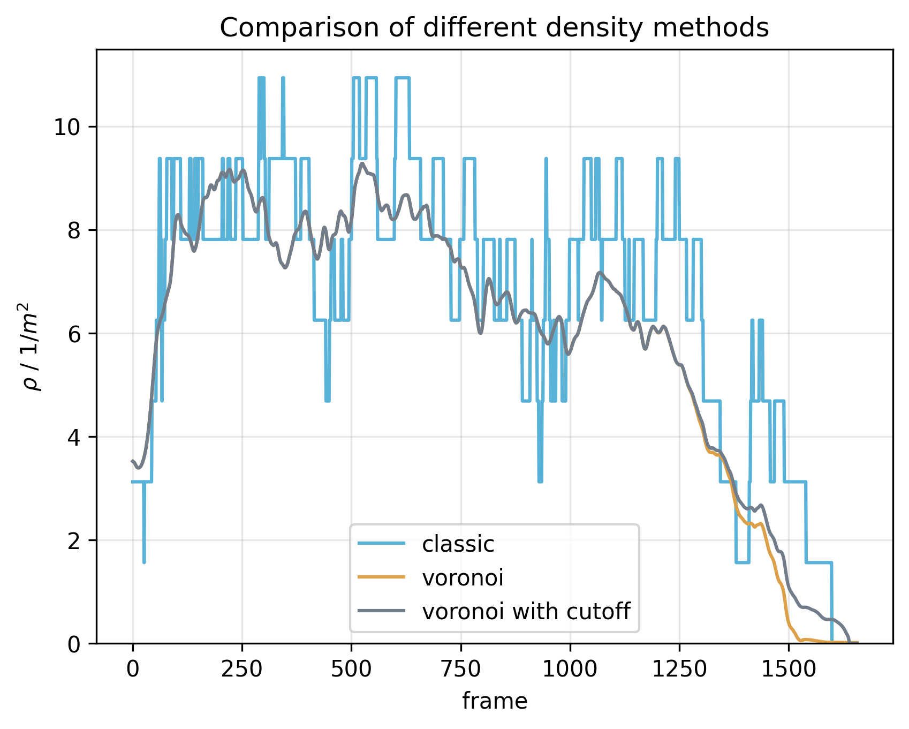

<div align="center">
    
</div>

-----------------
[](https://pypi.org/project/pedpy/)
[](https://test.pypi.org/project/PedPy/)

[](https://doi.org/10.5281/zenodo.7386931)
[](https://github.com/PedestrianDynamics/pedpy/blob/main/LICENSE)

[](https://github.com/psf/black)
[](https://pycqa.github.io/isort/)
[](http://pedpy.readthedocs.io/?badge=latest)
[](https://bestpractices.coreinfrastructure.org/projects/7046)
[](https://fair-software.eu)

# PedPy: Analysis of pedestrian dynamics based on trajectory files.  

`PedPy` is a python module for pedestrian movement analysis. 
It implements different measurement methods for density, velocity and flow.

This repo is a port from the original `JPSreport` to a Python implementation, and will provide the same functionalities.

## Getting started
### Setup Python
For setting up your Python Environment a Python version >= 3.8 is recommended (our code is tested with 3.8 and 3.10).
To avoid conflicts with other libraries/applications the usage of virtual environments is recommended, see [Python Documentation](https://docs.python.org/3/library/venv.html) for more detail.

### Installing PedPy
To install the latest **stable** version of `PedPy` and its dependencies from PyPI:
```bash
python3 -m pip install pedpy
```

If you want to install the current version in the repository which might be unstable, you can do so via:
```bash
python3 -m pip install --pre --index-url https://test.pypi.org/simple/ --extra-index-url https://pypi.org/simple/ pedpy
```

### Usage

The general usage of `PedPy` is demonstrated in the [usage notebook](notebooks/usage.ipynb).
The [JPSreport notebook](notebooks/jpsreport.ipynb) shows how to use `PedPy` to compute the same results as in the different JPSreport methods.

You can either download the notebooks and [demo files](demos/) from the GitHub repository or clone the whole repository with:
```bash 
git clone https://github.com/PedestrianDynamics/pedpy.git
```

For using either of the notebook some additional libraries need to be installed, mainly for plotting.
You can install the needed libraries with:

```bash
python3 -m pip install jupyter matplotlib
```

Afterwards you can start a jupyter server with:

```bash
jupyter notebook
```

After navigating to one of the notebooks, you can see how the library can be used for different kinds of analysis.

Some examples how the computed values can be visualized are also shown in the notebooks, e.g., density/velocity profiles, fundamental diagrams, N-T-diagrams, etc.



