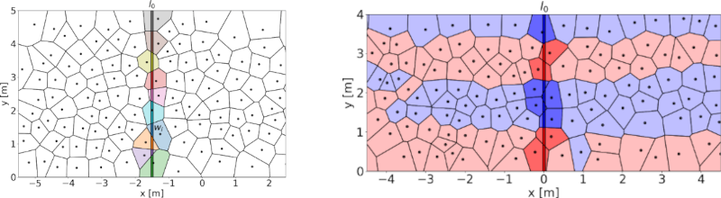

*********
Changelog
*********

Version 1.4.0 (2025-XX-YY)
==========================

Version 1.3.0 (2025-02-02)
==========================

**New feature:**

*Continuity equation and fundamental diagram of pedestrians* [#f1]_ describes a new approach to compute the fundamental diagram for pedestrian dynamics. 
This approach uses Voronoi decomposition to allow defintiions of density, speed and flow on the basis of trajectories in accordance with the continuity equation.
It also enables measurement along a line, handling different motion directions without losing velocity sign.

How to use the new method is shown in the following Jupyter-Notebook: :doc:`Fundamental Diagrams at Measurement Line <../fundamental_diagram_at_measurement_line>`

    
    Left: Voronoi decomposition, Voronoi cells which intersect with the measurement line are indicated by color. 
    Right: Voronoi decomposition, Red and blue indicate the main movememnt direction.

.. [#f1] J. Adrian, A. K. Boomers, S. Paetzke, and A. Seyfried, “Continuity equation and fundamental diagram of pedestrians.” arXiv, 2024. doi: 10.48550/ARXIV.2409.11857. Available: https://arxiv.org/abs/2409.11857 

Version 1.2.0 (2024-09-27)
==========================

**New features:**

- New speed profile method: Gauss
- New spatial analysis method: Pair distribution function
- New core measurement method: Acceleration
- Improve plotting:
    * In distance-line plots, the line can be colored in the speed of the pedestrian

**What's changed:**

- Improve plotting
- Column identifiers are now exposed at top-level, e.g., can be imported with :code:`from pedpy import *`

**Fixes:**

- Fix bug in :code:`compute_crossing_frames`, returning the frame a pedestrian may stand on line
- Improve documentation:
    * Fix in developer guide
    * Fix data types not displayed correctly in some parts of documentation
    * Restructure methods page and add new category names 
    * Add details about the Well-Known-Text (WKT) format
    * General minor documentation fixes and improvements

Version 1.1.3 (2024-08-30)
==========================

**Fixes:**

- Distance to time plot, now show the correct time

Version 1.1.2 (2024-06-16)
==========================

**Fixes:**

- Improve documentation: Show BibTeX for citation from Zenodo metadata (also for stable)

Version 1.1.1 (2024-06-12)
==========================

**Fixes:**

- Improve plotting of polygons:
    * Fill color of polygons does not show outside of the borders when using narraw :code:`line_width`
    * No gaps at the last point of the polygon boundary
- Improve documentation: Show BibTeX for citation from Zenodo metadata

Version 1.1.0 (2024-03-13)
==========================

**New features:**

* Add loading functions for different datatypes:
    * `JuPedSim <https://jupedsim.org/>`__ trajectory file
    * `Viswalk <https://www.ptvgroup.com/en-us/products/pedestrian-simulation-software-ptv-viswalk>`__ trajectory file
    * `Pedestrian Dynamics Data Archive <https://ped.fz-juelich.de/da/doku.php>`__ HDF5 file

* Improve profile computations:
    * Introduce separate function to compute speed and density profiles
    * Add classic and Gaussian density profile computation
    * Add mean speed profile computation

* Improve trajectory data:
    * Make trajectory data sliceable by frames: :code:`trajectory[0:100]`
    * Expose metadata as bounds, number pedestrians and frame range

**What's changed:**

* Nightly builds will no longer be uploaded to test-PyPI
* kwagrs now passed from plotting functions to matplotlib backend
* Support :class:`~shapely.GeometryCollection` as base for geometries
* Add support for Python 3.12
* Functions are now exposed at top-level, e.g., can be imported with :code:`from pedpy import *`

**Fixes:**

* Correct automatic computation of vmin and vmax when plotting profiles
* Use correct escape depending in plot label
* Improve documentation

Version 1.0.2 (2023-10-12)
==========================

**What's changed:**

* Make color map in plot_voronoi_cells adjustable

**Fixes:**

* Fix future warnings from Pandas
* Fix bug, when plotting multiple density distributions in subplots

Version 1.0.1 (2023-10-04)
==========================

**Fixes:**

- Add correct doi badge to documentation and readme

Version 1.0.0 (2023-09-22)
==========================

First release of *PedPy*.