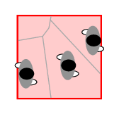

.. _density:
====================
Density
====================

Classic density
--------------------
.. image:: images/area.png
  :alt: Alternative text

For computing the classic density :math:`\rho_c` a measurement area :math:`m` with area :math:`A_m` is needed.
Now the number of pedestrians :math:`N` inside the measurement area is computed.

The classic density :math:`\rho_c` is defined as the number of pedestrians divided by the area of the measurement section:

.. math::
    \langle \rho_c \rangle_{m}=\frac{N}{A_m}

.. code-block:: python

    def compute_classic_density(
        *,
        traj_data: pd.DataFrame,
        measurement_area: Polygon,
    ) -> pd.DataFrame:
    """Compute the classic density of the trajectory per frame inside the given
     measurement area.

    Args:
        traj_data (pd.DataFrame): trajectory data to analyze
        measurement_area (shapely.Polygon): area for which the density is
            computed

    Returns:
        DataFrame containing the columns: 'frame' and 'classic density'
    """

Voronoi density
--------------------

.. code-block:: python

    def compute_voronoi_density(
        *,
        traj_data: pd.DataFrame,
        measurement_area: shapely.Polygon,
        geometry: Geometry,
        cut_off: Tuple[float, int] = None,
    ) -> Tuple[pd.DataFrame, pd.DataFrame]:
        """Compute the voronoi density of the trajectory per frame inside the given
        measurement area.

        Args:
            traj_data (pd.DataFrame): trajectory data to analyze
            measurement_area (shapely.Polygon): area for which the density is
                computed
            geometry (Geometry): bounding area, where pedestrian are supposed to be
            cut_off (Tuple[float, int): radius of max extended voronoi cell (in m),
                    number of linear segments in the approximation of circular
                    arcs, needs to be divisible by 4!

        Returns:
              DataFrame containing the columns: 'frame' and 'voronoi density',
              DataFrame containing the columns: 'ID', 'frame', 'individual voronoi',
                    'intersecting voronoi'
        """

.. code-block:: python

    def compute_individual_voronoi_polygons(
        *,
        traj_data: pd.DataFrame,
        geometry: Geometry,
        cut_off: Tuple[float, int] = None,
    ) -> pd.DataFrame:
        """Compute the individual voronoi cells for each person and frame

        Args:
            traj_data (pd.DataFrame): trajectory data
            geometry (Geometry): bounding area, where pedestrian are supposed to be
            cut_off (Tuple[float, int]): radius of max extended voronoi cell (in m),
                    number of linear segments in the approximation of circular arcs,
                    needs to be divisible by 4!
        Returns:
            DataFrame containing the columns: 'ID', 'frame' and 'individual voronoi'.
        """

Passing density
--------------------
.. image:: images/passing_line.png
  :alt: Alternative text

.. code-block:: python

    def compute_passing_density(
        *, density_per_frame: pd.DataFrame, frames: pd.DataFrame
    ) -> pd.DataFrame:
        """Compute the individual density of the pedestrian who pass the area.

        Args:
            density_per_frame (pd.DataFrame): density per frame, DataFrame
                    containing the columns: 'frame' (as index) and 'density'
            frames (pd.DataFrame): information for each pedestrian in the area,
                    need to contain the following columns: 'ID','frame_start',
                    'frame_end'

        Returns:
              DataFrame containing the columns: 'ID' and 'density' in 1/m
        """
