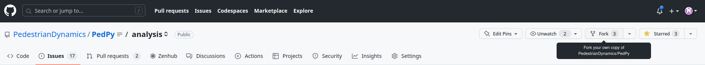
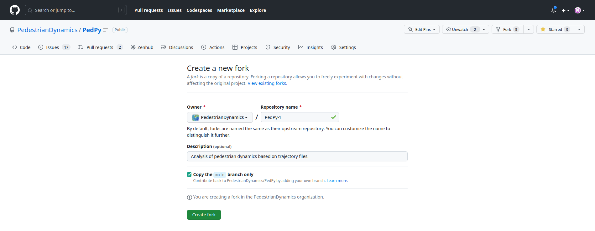

.. _development:

===========
Development
===========

Whether you're a seasoned developer or new to Python, there are many ways you can contribute to *PedPy*.
If you're interested in improving the library's functionality, we encourage you to get involved in the development process.
Our code base is open source and available on GitHub, so you can easily contribute by submitting pull requests or reporting issues and bugs.
We also welcome feedback on new features or enhancements that you think would be useful.

If you're not comfortable contributing to the code base just yet, you can still help us by reporting any errors or bugs you encounter while using *PedPy*.
Your feedback is incredibly valuable and helps us to improve the library for everyone.

We're committed to creating a supportive and inclusive community that values collaboration and sharing knowledge.
So don't hesitate to reach out with any questions or ideas you may have. We look forward to seeing what you can accomplish with *PedPy*!

Reporting bugs
==============

At *PedPy*, we value feedback from our users, and we encourage you to report any issues or bugs that you encounter while using the library.
You can do this by visiting our `GitHub issues page <https://github.com/PedestrianDynamics/PedPy/issues>`_.
From there, you can submit a new issue, provide a detailed description of the problem, and even include code snippets or screenshots to help us better understand the issue.

By reporting bugs and issues, you're helping us to improve *PedPy* and make it more robust and reliable for everyone.
So don't hesitate to speak up - we appreciate your input and look forward to working with you to make *PedPy* the best it can be!

Enhancement requests
====================

You can submit feature requests on our `GitHub discussions <https://github.com/PedestrianDynamics/PedPy/discussions>`_.
When submitting a feature request, please provide a clear and detailed description of the feature you would like to see added, along with any relevant use cases or examples.

We can't promise to implement every feature request, but we do carefully consider all requests and prioritize them based on their potential impact on the community and feasibility.
Your input is valuable to us and helps us to ensure that *PedPy* is meeting the needs of our users.

So if you have a great idea for a new feature or enhancement, don't hesitate to share it with us. We're excited to hear from you and look forward to continuing to improve *PedPy* together!

Contribute to the code
======================

We are thrilled that you want to contribute *PedPy*!
Your contribution can make a real difference in the success of the project, and we appreciate your interest in helping out.

To ensure that your contribution is successful, we have put together a guide that explains how you can get started and make the most out of your contribution.
This guide includes instructions on setting up your development environment, finding a suitable task to work on, and submitting your changes for review.

Setting up your development environment is an essential step that will allow you to test your changes locally and ensure that they work as expected.
Our guide will walk you through the steps of setting up your environment and making sure that you have all the necessary tools and dependencies.

Thank you again for your interest in contributing to our project.
We look forward to working with you and seeing your contributions!

Version control, Git, and GitHub
--------------------------------

If you're a new developer looking to contribute to `PedPy`, we have a streamlined process that utilizes Git and a fork-based approach on GitHub.
For contributing you need to create a GitHub account first.
We will try to explain the main git commands you will need to contribute to `PedPy`, but for a deeper understanding of Git and how it works we refer to the official documentation of `Git <https://git-scm.com/book/en/v2/Getting-Started-What-is-Git%3F>`_ and `GitHub <https://docs.github.com/en/get-started/quickstart/hello-world>`_.

**1. Fork the Repository:** Start by forking our project's repository on GitHub.
This creates a personal copy of the project under your GitHub account, allowing you to freely make changes without affecting the original codebase.
First navigate to our GitHub repository at https://github.com/PedestrianDynamics/PedPy and click on `Fork`.



Afterwards you specify the location of the fork, this is usually just your GitHub Account.



**2. Clone the Forked Repository**: Next, clone the forked repository to your local development environment using Git. This creates a local copy of the codebase on your machine, enabling you to make changes and test them locally.
The correct command can also be found on GitHub in your fork.
Otherwise make sure to replace :code:`<your-username>` with your actual GitHub user name.

.. code-block:: bash

    $ git clone https://github.com/<your-username>/PedPy.git

or

.. code-block:: bash

    $ git clone git@github.com:<your-username>/PedPy.git


**3. Create a Branch:** Before making any modifications, create a new branch in your local repository.
This helps keep your changes isolated from the main codebase.
Give the branch a descriptive name that reflects the purpose of your contribution.

.. code-block:: bash

    $ git checkout -b your-branch-name

**4. Make Changes and Commit:** Now, you can start making your desired modifications, whether it's fixing a bug, adding a new feature, or improving existing code.
As you progress, make small and logical commits to track your changes effectively.

.. code-block:: bash

    $ git add .
    $ git commit -m "Your commit message"

**5. Push Changes and Open a Pull Request:** Once you are satisfied with your changes, push the branch to your forked repository on GitHub. From there, you can open a Pull Request (PR) against the original project's repository. This allows the project maintainers to review your changes, provide feedback, and merge them into the main codebase if they meet the project's guidelines and standards.

.. code-block:: bash

    $ git push origin your-branch-name

Throughout this process, it's important to keep your forked repository in sync with the original project by regularly fetching and merging the latest changes from the upstream repository.
This ensures that your contributions are based on the most recent code.

.. code-block:: bash

    git remote add upstream https://github.com/PedestrianDynamics/PedPy.git
    git fetch upstream
    git merge upstream/main

By following this Git and fork-based approach, you can confidently contribute to our Python project, collaborate with other developers, and make a positive impact on the codebase.
We appreciate your interest in contributing and look forward to reviewing your Pull Requests!

Setting up development environment
----------------------------------

After you have cloned the `PedPy` repository, you need to install all dependencies which are needed to work with *PedPy*.
The first step is to install Python on your machine if not already done.
To ensure, that you to not issues with conflicting dependencies of other Python packages you use we highly recommend to use a separate virtual environment for *PedPy*.
A detailed description, why and how virtual environments can used is explained on the official `Python documentation <https://docs.python.org/3/tutorial/venv.html>`_

Assuming that you are in the directory which contains the `PedPy` folder from the ``git clone`` command, we can now create a virtual environment here:

.. code-block:: bash

  $ python3 -m venv pedpy-venv

This will create the new virtual environment in a folder next to the `PedPy` folder, e.g.,:

::

    some directory
    ├── PedPy
    └── pedpy-env


Once you’ve created a virtual environment, you may activate it.
On Windows, run:

.. code-block:: bash

  $ pedpy-venv\Scripts\activate.bat

On Unix or MacOS, run:

.. code-block:: bash

  $ source pedpy-venv/bin/activate

Activating the virtual environment will change your shell’s prompt to show what virtual environment you’re using, and modify the environment so that running python will get you that particular version and installation of Python.
For example:

.. code-block:: bash

    $ source pedpy-venv/bin/activate
    (pedpy-venv) $ python
    Python 3.10.10 (main, Mar  5 2023, 22:26:53)
      ...
    >>> import sys
    >>> sys.path
    ['', '/usr/local/lib/python310.zip', ...,
    '~/pedpy-venv/lib/python3.10/site-packages']
    >>>

Now, after activating the virtual environment you can install all dependencies for *PedPy* with:

.. code-block:: bash

  (pedpy-venv) $ cd PedPy
  (pedpy-venv) $ python -m pip install -r requirements.txt

Now everything is setup for you to start developing in *PedPy*!

One way to test your code locally is to install it *PedPy* from the root directory with:

.. code-block:: bash

  (pedpy-venv) $  python -m pip install -e .


Structure of the code
---------------------

To give you a small overview how *PedPy* is organized, take a look:

::

    PedPy
    ├── docs
    ├── notebooks
    ├── pedpy
    │   ├── data
    │   ├── io
    │   ├── methods
    │   └── plotting
    ├── scripts
    └── tests


* ``PedPy`` is the folder we get when we issue the ``git clone`` command.

* ``docs`` contains the everything related to our online documentation.

* ``notebooks`` holds Jupyter notebooks show casing how *PedPy* can be used.

* ``pedpy`` is the actual Python package directory, where our Python source files reside.

  * ``data`` contains all files related to internally used data structures.

  * ``io`` holds files responsible for reading and writing files into internal structures.

  * ``methods`` the place where the actual analyzing methods reside.
    The underlying Python files are structured in their compute domain, i.e., density, velocity, flow, or profiles.
    Some function may be used in different situations, these should be placed in ``method_utils.py``.

  * ``plotting`` contains everything which will help users to plot some of our results.

* ``scripts`` the place for some handy scripts.

* ``tests`` is the directory, where all our tests reside.


Tests
-----

We use unit and reference tests in our continuous integration (CI) process to ensure that our code is of high quality and that it behaves as expected.

Unit tests are used to test small, isolated parts of our code, such as individual functions or methods.
By testing each part of the code in isolation, we can quickly identify any issues or bugs in that specific area of the codebase.
This helps us catch issues early on, before they can propagate to other parts of the code and become more difficult to fix.
Currently we do not cover everything with unit-tests, this will hopefully change at some point.

Reference tests are used to test the behavior of our code against a known set of inputs and expected outputs.
By comparing the actual output of our code against the expected output, we can quickly identify any issues or bugs that might have been introduced during development.
As we see *PedPy* as successor of *JPSreport* we want to ensure, that we get the same results as with *JPSreport*.
Hence, we use results from *JPSreport* in different scenarios as reference.

As we do not only want to ensure that the results are correct, but also want to provide working examples for new user.
Thus, we check whether all notebooks in our repository work with the latest changes.
This ensures, that users can use these notebooks as reference when setting up their analyzes.

We use *GitHub Actions* to automate our testing, every Pull Request will be automatically trigger the workflow which then runs the tests.
Only Pull Request with succeeding pipelines will be allowed to be merged into the ``main`` branch.


Formatting/Linting
------------------

Aside from the functional requirements (see :ref:`Tests`) for changes in the code base, we also have some non-functional requirements.
These will also be checked in our CI process for each Pull Request.
To ensure compliance with these requirements, we have integrated pre-commit hooks into the repository.

1. **Install Pre-Commit Hooks:**

To simplify and automate formatting, linting, and type checking, we use pre-commit hooks. This will ensure that every commit is checked against our formatting, linting, and type hinting standards before being accepted.

To set up the pre-commit hooks locally, run the following command:

```bash
pip install pre-commit
pre-commit install
```
Now, every time you commit changes, the hooks will automatically run, checking for issues related to formatting, linting, and type hints.

1. **Code formatting:**
To ensure that your Pull Request may get accepted, make sure that the code is formatted with ``ruff format``.
We provide a helper script (``scripts/format.sh``) that will format every file in the correct manner.
To test it locally you can use ``scripts/check-format.sh``.

2. **Type Hints:**
We decided that every function, parameter, return value, etc. should be annotated with type hints, as they make it clearer for users what to expect and what is needed.
For ensuring that no type hint is forgotten we use ``MyPy``.
This can be checked locally via ``python3 -m mypy --config-file mypy.ini pedpy/``

3. **Linting:**
Linting in Python is an important process that helps ensure that our code is consistent and adheres to best practices.
Linting tools like ``ruff`` analyze our code for potential errors, bad practices, and code smells.
This helps us catch issues early on and prevents them from becoming bigger problems down the line.

4. **Docstring style:** (included in linting)
Make sure to check whether every of your new functions has a docstring.
We decided to use Google-docstring style to be used in our project.
You can use `ruff` to check if everything is correct locally.

If you want to run the same tests as in the CI pipeline, you can use ``scripts/ci.sh``.

Update documentation
====================

The documentation is written in **reStructuredText**, which is almost like writing in plain English, and built using `Sphinx <https://www.sphinx-doc.org/en/master/>`__.
The Sphinx Documentation has an excellent `introduction to reStructuredText <https://www.sphinx-doc.org/en/master/usage/restructuredtext/basics.html>`__.
Review the Sphinx docs to perform more complex changes to the documentation as well.

Also important to know about the docs:


How to build the documentation
------------------------------

To build the documentation locally, you need to setup a development environment.
As above, it is recommend to use a virtual environment for this.
Also make sure that *PedPy* is installed in this environment:

.. code:: bash

    (pedpy-venv) $  python -m pip install -e .


To install all the needed requirements for building the documentation use:

.. code:: bash

    (pedpy-venv) $ pip install -r docs/requirements.txt

Afterwards you can build the documentation with:

.. code:: bash

    (pedpy-venv) $ sphinx-build -T -b html -a docs/source docs/build

This might take a while as the notebooks will be executed, to exclude every notebook you can run the following command:

.. code:: bash

    (pedpy-venv) $ sphinx-build -T -b html -a docs/source docs/build -D nb_execution_excludepatterns='**.ipynb'


It will create a new folder ``build/`` in which the websites are built.
To preview it locally, open ``build/index.html`` in any browser of your liking.


Preview changes
---------------

Once, the pull request is submitted, GitHub Actions will automatically build the documentation.
To view the built site:

1. Wait for CI to finish the `docs/readthedocs.org:pedpy` job
2. Click on `Details`

Alternatively, you can find the documentation for a pull request, after the CI job has finished, under the following link.
As each pull request has a unique number, you need to substitute for ``<#PR>`` in the link:

.. code:: text

    https://pedpy--<#PR>.org.readthedocs.build/en/<#PR>/

Contact
=======

If you need any help, please feel free to open discussions on GitHub or join us in our RocketChat Channel:

.. grid:: 1 2 2 2
    :gutter: 4
    :padding: 2 2 0 0
    :class-container: sd-text-center

    .. grid-item-card:: GitHub Discussions
        :img-top: _static/github_logo.svg
        :class-card: intro-card
        :link: https://github.com/PedestrianDynamics/PedPy/discussions
        :link-alt: To the GitHub discussions

    .. grid-item-card:: RocketChat User Group
        :img-top: _static/rocketchat_logo.svg
        :class-card: intro-card
        :link: https://juchat.fz-juelich.de/channel/pedpy-usergroup
        :link-alt: To the RocketChat User Group
