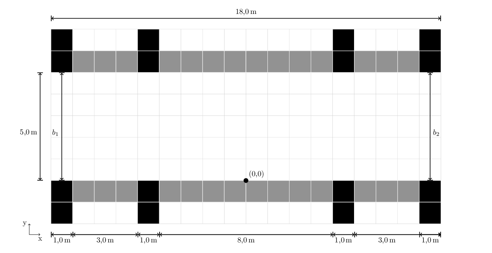
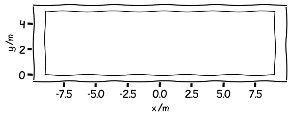
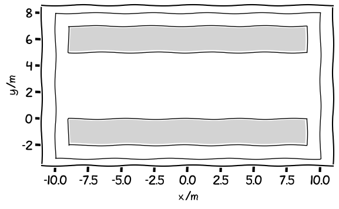
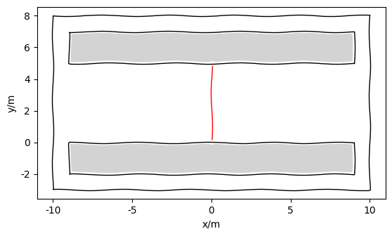
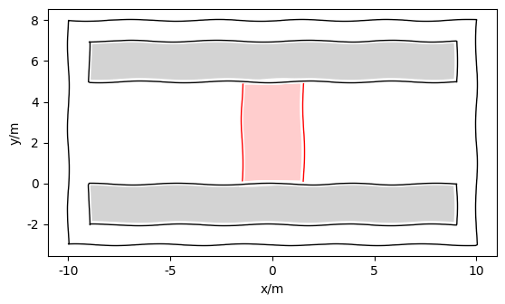

.. _getting_started:

===============
Getting started
===============

Install PedPy
=============

Setup Python
------------
For setting up your Python virtual environment a Python version >= 3.8 is recommended (our code is tested with 3.8 and 3.10).
To avoid conflicts with other libraries/applications the usage of virtual environments is recommended, see `Python Documentation for virtual environments <https://docs.python.org/3/library/venv.html>`__ for more detail.

PedPy
-----

To install the latest **stable** version of *PedPy* and its dependencies from PyPI:

.. code-block::

    python3 -m pip install PedPy

If you want to install the current version in the repository which might be unstable, you can do so via:

.. code-block::

    python3 -m pip install --pre --index-url https://test.pypi.org/simple/ --extra-index-url https://pypi.org/simple/ PedPy

Setting up analysis
===================

For setting up meaningful analysis with *PedPy* some data needs to be prepared.
If you do not have any data on your own, but want to see how *PedPy* can be used, different trajectories from various experiments can be found in out `data repository <https://ped.fz-juelich.de/da/doku.php>`__.

Trajectory
----------
The most important data for analyzing pedestrian movements are the trajectories of the pedestrians.
They can either originate from experiments, field observations, or simulations.

*PedPy* can load trajectories from text files, when:

- values are seperated by any whitespace, e.g., space, tab
- file has at least 5 columns in the following order: "ID", "frame", "X", "Y", "Z", any additional columns will be ignored!
- file may contain comment lines with `#` at in the beginning

For meaningful analysis (and loading of the trajectory file) you also need

- unit of the trajectory (m or cm)
- frame rate

Examples
^^^^^^^^

With frame rate, but no unit:

.. code-block:: text

    # description: UNI_CORR_500_01
    # framerate: 25.00
    #geometry: geometry.xml

    # PersID	Frame	X	Y	Z
    1	98	4.6012	1.8909	1.7600
    1	99	4.5359	1.8976	1.7600
    1	100	4.4470	1.9304	1.7600
    ...

No header at all:

.. code-block:: text

    1 27 164.834 780.844 168.937
    1 28 164.835 771.893 168.937
    1 29 163.736 762.665 168.937
    1 30 161.967 753.088 168.937
    ...

Geometry
--------

For handling geometrical data in *PedPy* we use `Shapely >= 2.0 <https://shapely.readthedocs.io/en/latest/>`__.
One other important step when setting up the analysis is the geometrical boundary of the environment.
These boundaries are defined as `Shapely Polygons <https://shapely.readthedocs.io/en/latest/manual.html#polygons>`__.

.. note::

    All geometric data in *PedPy* is handled in meter (m).

Assuming you have a experimental setup like this, you have different method to setup the geometry for *PedPy*:

Only consider the walkable area
^^^^^^^^^^^^^^^^^^^^^^^^^^^^^^^

The simplest solution would be to create a ``Polygon`` only containing the walkable area of the experimental setup.
In this case, this would be:

.. code:: python

    from shapely import Polygon
    from pedpy import Geometry

    walkable_area = Polygon([(-9, 0), (-9, 5), (9, 5), (9, 0)])
    geometry = Geometry(walkable_area=walkable_area)

Create a bounding box with obstacles
^^^^^^^^^^^^^^^^^^^^^^^^^^^^^^^^^^^^

Alternatively, it is also possible to create a larger bounding box and put some obstacles in the area to create the desired environment.
This might be the best solution in more complex geometries.
The obstacles are again `Shapely Polygons <https://shapely.readthedocs.io/en/latest/manual.html#polygons>`__.

.. note::

    The obstacles need to be completely inside the walkable area, otherwise they will be ignored!

.. code:: python

    from shapely import Polygon
    from pedpy import Geometry

    walkable_area = Polygon([(-10, -3), (-10, 8), (10, 8), (10, -3)])
    obstacles = [
        Polygon([(-9, -2), (-9, 0), (9, 0), (9, -2), (-9, -2)]),
        Polygon([(-9, 5), (-9, 7), (9, 7), (9, 5), (-9, 5)])
    ]
    geometry = Geometry(walkable_area=walkable_area, obstacles=obstacles)

    # or add the obstacles one by one
    geometry = Geometry(walkable_area=walkable_area)
    geometry.add_obstacle(Polygon([(-9, -2), (-9, 0), (9, 0), (9, -2), (-9, -2)]))
    geometry.add_obstacle(Polygon([(-9, 5), (-9, 7), (9, 7), (9, 5), (-9, 5)]))

Measurement
-----------

In most cases the analysis is not done in the complete at specific points inside the setup.
These can either be measurement lines, or measurement areas.

Measurement line
^^^^^^^^^^^^^^^^

A measurement line is a line between **two** points in the setup.
They are defined as `Shapely LineStrings <https://shapely.readthedocs.io/en/latest/manual.html#linestrings>`__.

.. code:: python

    from shapely import LineString

    measurement_line = LineString([(0, 0), (0, 5)])

Measurement area
^^^^^^^^^^^^^^^^

A measurement area is a specific area inside the setup, which will be used for the analysis.
The area is a `Shapely Polygons <https://shapely.readthedocs.io/en/latest/manual.html#polygons>`__.

.. warning::

    For reasonable results it is highly recommended to only use convex polygons as measurement area.
    In most cases, the measurement areas should be rectangular!

.. code:: python

    from shapely import Polygon

    measurement_area = Polygon([(-1.5, 0), (-1.5, 5), (1.5, 5), (1.5, 0), (-1.5, 0)])

